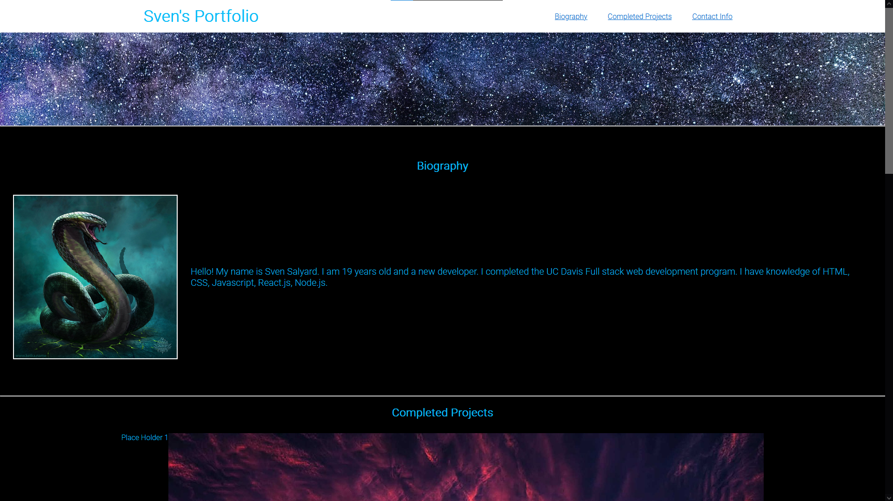

# Svens-Portfolio

## Description

This webpage is a portfolio of my coding projects. It can be used to see my latest work, read about me, or view my contact information. The image cards at the bottom can be used to view every project I have completed. It was a nice challange to format this webpage.

## Installation

N/A

## Useage

You can go to https://svensalyard.github.io/Svens-Portfolio/ to view the webpage and click through the navbar links on the top right to navigate through the webpage.

## Credits

The first homework that I completed really helped. Also, the media query, responsiveness, and other in class activities really
helped too.

Websites:
Image As A Link: https://www.tutorialspoint.com/How-to-use-an-image-as-a-link-in-HTML
Hover Transformation: https://www.joshwcomeau.com/animation/css-transitions/

Images used:
Background Image: https://www.pexels.com/photo/blue-universe-956981/
Snake: https://www.artstation.com/artwork/X1GVa
Tree: https://pixabay.com/photos/tree-sunset-clouds-sky-silhouette-736885/
Australian Shepherd: https://hips.hearstapps.com/hmg-prod/images/beautiful-australian-shepherd-walking-royalty-free-image-168814214-1565190235.jpg
Under Water: https://images.pexels.com/photos/15591206/pexels-photo-15591206/free-photo-of-under.jpeg
Rocks on A Lake: https://images.pexels.com/photos/141361/pexels-photo-141361.jpeg
City with Waves: https://images.pexels.com/photos/15590299/pexels-photo-15590299/free-photo-of-city.jpeg

## License

Please refer to the LICENSE in the repo.